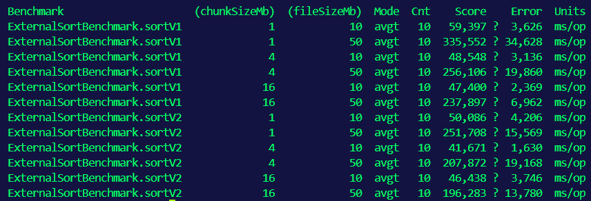
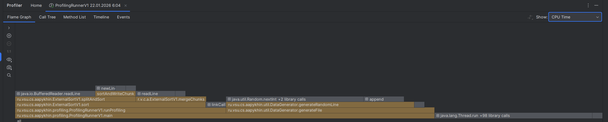
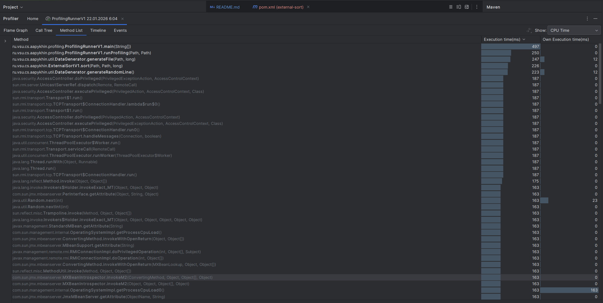
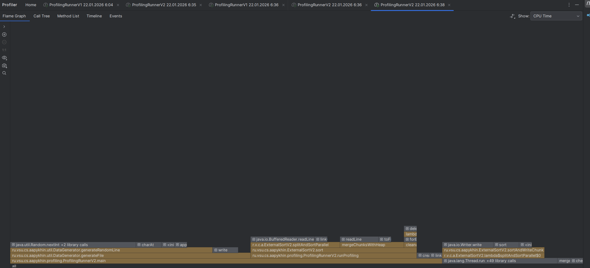
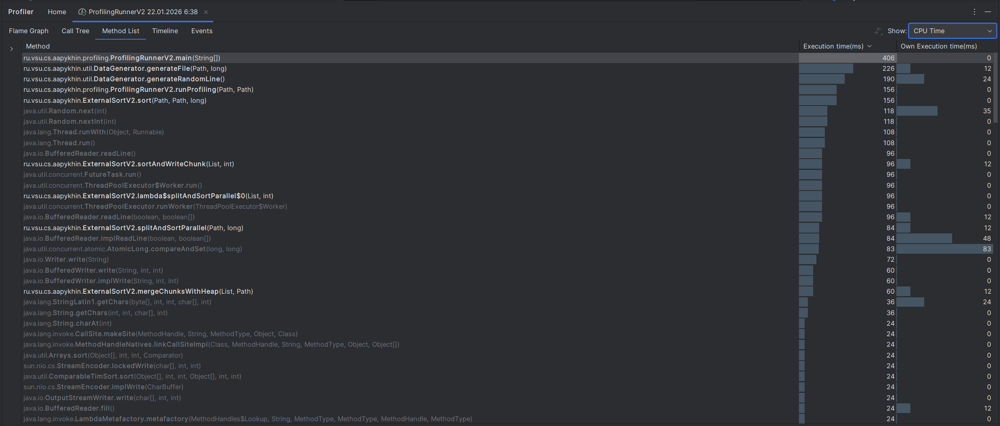
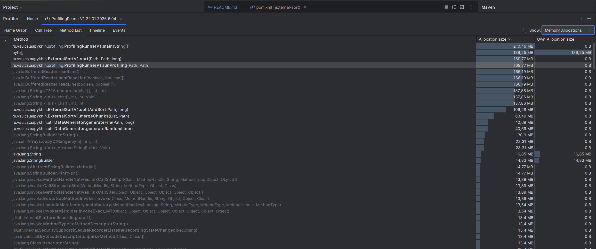
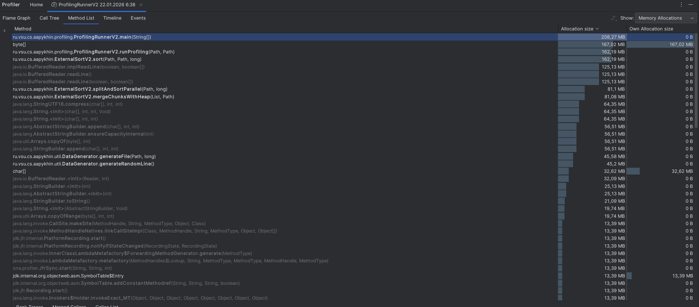

# Лабораторная работа №2: Разработка структуры данных с внешней памятью

## Структура проекта

Проект содержит две реализации внешней сортировки слиянием (External Merge Sort) для файлов, которые не помещаются в оперативную память. Исходный код находится в пакете `ru.aapykhin.lab2`.

```
src/main/java/ru/aapykhin/lab2/
├── ExternalSorter.java           # Интерфейс сортировщика
├── ExternalSortV1.java           # Базовая реализация (линейный поиск)
├── ExternalSortV2.java           # Оптимизированная реализация (PriorityQueue)
├── ComparisonTest.java           # Сравнительный тест V1 vs V2
├── util/
│   └── DataGenerator.java        # Генератор тестовых данных
├── benchmark/
│   └── ExternalSortBenchmark.java  # JMH бенчмарк
└── profiling/
    ├── ProfilingRunnerV1.java    # Profiler runner для V1
    └── ProfilingRunnerV2.java    # Profiler runner для V2

src/test/java/ru/aapykhin/lab2/
└── ExternalSortTest.java         # Unit-тесты
```

## Описание алгоритмов

### External Merge Sort — общий принцип

Внешняя сортировка слиянием применяется когда данные не помещаются в оперативную память целиком. Алгоритм состоит из двух фаз:

1. **Фаза разбиения**: файл читается блоками (chunks), каждый блок сортируется в памяти и записывается во временный файл
2. **Фаза слияния (K-way Merge)**: все временные файлы объединяются в один отсортированный

### ExternalSortV1 — базовая реализация

V1 использует простой подход:
- **Последовательная сортировка** блоков — один поток
- **Линейный поиск минимума** при K-way merge — O(k) на каждую строку
- **Стандартные буферы I/O** — 8KB по умолчанию

**Сложность K-way merge**: O(n × k), где n — общее число строк, k — число временных файлов.

### ExternalSortV2 — оптимизированная реализация

V2 использует три оптимизации:
- **Параллельная сортировка** блоков через ExecutorService — использует все ядра CPU
- **PriorityQueue (min-heap)** для K-way merge — O(log k) на каждую строку
- **Увеличенные буферы I/O** — 64KB вместо 8KB

**Сложность K-way merge**: O(n × log k) — логарифмическое улучшение.

## Результаты тестов

Все unit-тесты проходят успешно:

```
[INFO] Tests run: 12, Failures: 0, Errors: 0, Skipped: 0
[INFO] BUILD SUCCESS
```

Тесты покрывают:
- Корректность сортировки для V1 и V2
- Идентичность результатов обеих версий
- Различные размеры входных данных (100, 500, 1000, 5000 строк)
- Пограничные случаи (пустой файл, одна строка, уже отсортированные данные)
- Интеграцию с DataGenerator

## Результаты JMH Benchmark

Бенчмарк измеряет среднее время сортировки в миллисекундах (меньше — лучше):



| Benchmark | chunkSizeMb | fileSizeMb | V1 (ms) | V2 (ms) | V2 быстрее на |
|-----------|-------------|------------|---------|---------|---------------|
| sort      | 1           | 10         | 59.4    | 50.1    | **16%**       |
| sort      | 1           | 50         | 335.6   | 251.7   | **25%**       |
| sort      | 4           | 10         | 48.5    | 41.7    | **14%**       |
| sort      | 4           | 50         | 256.1   | 207.9   | **19%**       |
| sort      | 16          | 10         | 47.4    | 46.4    | **2%**        |
| sort      | 16          | 50         | 237.9   | 196.3   | **17%**       |

**Вывод**: V2 стабильно быстрее V1 на **14-25%**. Наибольший выигрыш при маленьком размере chunk (1 MB), когда создаётся много временных файлов и PriorityQueue даёт максимальное преимущество.

## Результаты профилирования

Профилирование выполнено с помощью IntelliJ Profiler (20 MB файл, 1 MB chunk, 3 итерации).

### V1 — CPU Time





| Метод                          | Execution time (ms) |
|--------------------------------|---------------------|
| `ProfilingRunnerV1.main`       | 897                 |
| `ExternalSortV1.sort`          | 267                 |
| `ExternalSortV1.splitAndSort`  | 179                 |
| `ExternalSortV1.mergeChunks`   | 88                  |
| `DataGenerator.generateFile`   | 494                 |

**Основные затраты CPU в V1**:
- `splitAndSort()` — последовательная сортировка блоков
- `mergeChunks()` — линейный поиск минимума O(k) на каждую строку
- Генерация тестовых данных занимает значительную часть времени

### V2 — CPU Time





| Метод                              	| Execution time (ms) |
|---------------------------------------|---------------------|
| `ProfilingRunnerV2.main`           	| 709                 |
| `ExternalSortV2.sort`              	| 178                 |
| `ExternalSortV2.splitAndSortParallel` | 105              	  |
| `ExternalSortV2.mergeChunksWithHeap`  | 72               	  |
| `lambda$splitAndSortParallel`      	| 71                  |
| `DataGenerator.generateFile`       	| 494                 |

**Основные затраты CPU в V2**:
- `splitAndSortParallel()` — параллельная сортировка использует несколько потоков
- `mergeChunksWithHeap()` — PriorityQueue обеспечивает O(log k) поиск минимума
- Видны lambda-вызовы параллельных задач

### Сравнение Memory Allocations

**V1 — Memory:**



**V2 — Memory:**



| Метрика                      | V1      						   | V2      						  |
|------------------------------|-----------------------------------|----------------------------------|
| **Общий объём аллокаций**    | ~273 MB 						   | ~197 MB 						  |
| Основные источники           | ArrayList, String, BufferedReader | ArrayList, String, PriorityQueue |

**Вывод по памяти**: V2 использует меньше памяти благодаря более эффективной структуре данных и параллельной обработке (меньше данных держится в памяти одновременно).

## Анализ результатов

### Почему V2 быстрее V1?

1. **PriorityQueue vs линейный поиск**
   - V1: O(k) сравнений на каждую строку при merge
   - V2: O(log k) сравнений на каждую строку
   - При 20 временных файлах: 20 vs ~4 сравнений

2. **Параллельная сортировка блоков**
   - V1: последовательная сортировка — 1 поток
   - V2: параллельная через ExecutorService — N потоков

3. **Увеличенные буферы I/O**
   - V1: 8KB буферы по умолчанию
   - V2: 64KB буферы
   - Меньше системных вызовов при работе с диском

### Влияние размера chunk

| Размер chunk | Кол-во временных файлов (50MB) | Выигрыш V2 |
|--------------|--------------------------------|------------|
| 1 MB         | ~50 файлов                     | **25%**    |
| 4 MB         | ~12 файлов                     | **19%**    |
| 16 MB        | ~3 файла                       | **17%**    |

Чем меньше chunk → больше временных файлов → больше выигрыш от O(log k).

## Выводы

Проведённая работа демонстрирует эффективность оптимизаций при работе с внешней памятью. V2 на **14-25% быстрее** V1 благодаря:

1. **PriorityQueue** — ключевая оптимизация для K-way merge. Снижение сложности с O(k) до O(log k) даёт измеримый выигрыш при большом количестве временных файлов.

2. **Параллельная сортировка** — использование всех ядер CPU для сортировки блоков ускоряет первую фазу алгоритма.

3. **Буферизация I/O** — увеличение буферов уменьшает количество системных вызовов.